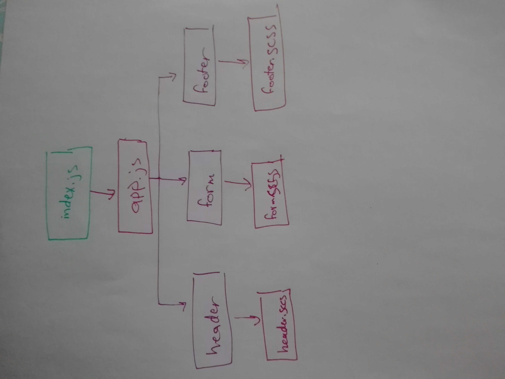

# LAB - Class 27

## Project: RESTy

### Author: Batool Al-Ali

### Links and Resources

- [submission PR](https://github.com/batool-alali-401-advanced-javascript/RESTy/pull/1)
- [ci/cd]()
- [netlify]()
- [gh-page]()

### Setup
` $npx i `

#### How to initialize/run your application 
- `$ npm start`

#### UML
