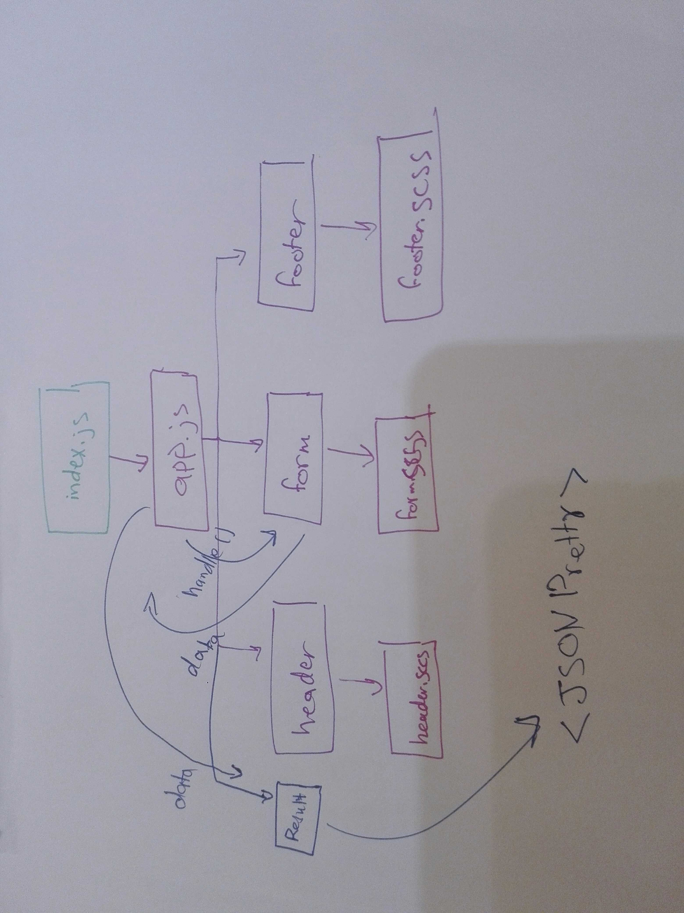

# LAB - Class 28

## Project: RESTy

### Author: Batool Al-Ali

### Links and Resources

- [submission PR](https://github.com/batool-alali-401-advanced-javascript/RESTy/pull/8)
- [netlify](https://restyv2.netlify.app/)
- [gh-page](https://batool-alali-401-advanced-javascript.github.io/)

### Setup
` $npx i `

#### How to initialize/run your application 
- `$ npm start`

#### UML
